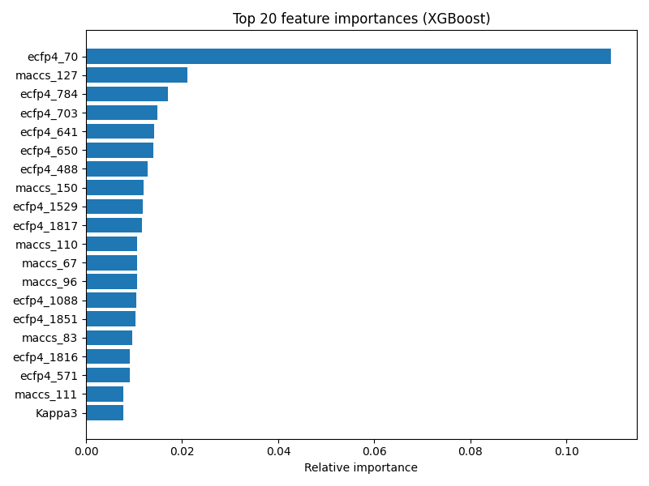
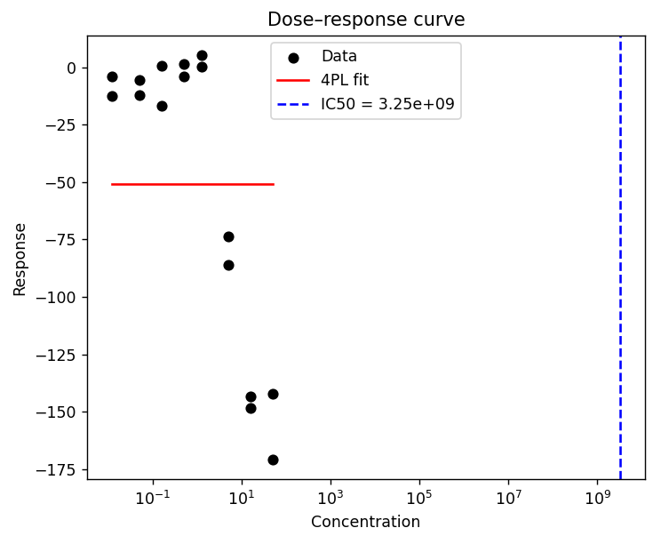
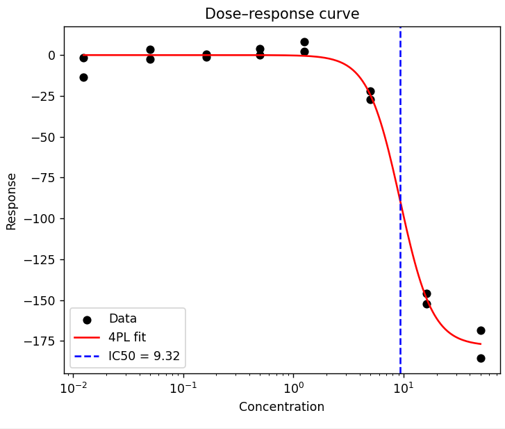

# Activity_Prediction_Machine_Learning iteration 1
Machine learning analysis of EU-OPENSCREEN data to predict compound activity and identify important molecular features.

---

## Overview

This project builds machine learning models to predict compound activity (pIC50) from experimental data and molecular descriptors. The goal is not only to predict activity, but to understand how model outputs can guide the design of more meaningful chemical features.

This project follows an iterative workflow:
- train models on standard descriptors 
- identify important features 
- interpret whether these reflect real chemistry or artefacts 
- use this to guide feature engineering for improved models 

---

## Dataset

- >500 compounds  
- Activity measured across multiple concentrations (dose–response)  
- SMILES available for all compounds  

### Processing

- IC50 values generated from dose–response data  
- Converted to pIC50 for modelling  
- Molecular descriptors generated using:
  - RDKit descriptors  
  - MACCS fingerprints  
  - ECFP4 fingerprints  

---

## Objectives

- Build models to predict compound activity from molecular descriptors  
- Evaluate impact of feature sets on model performance   

---

## Key Findings & Decisions

### 1. A single outlier dominates model behaviour

- One molecular fingerprint feature (ECFP4_70) is the most important in the model

- Only one compound in this dataset has this feature

**Effect:**  
- Strongly drives feature importance (e.g. ECFP4_70)  
- Distorts model learning towards a single extreme example

**Interpretation:**  
- The objective of the modelling workflow was to identify chemical features associated with broadly transferable binding/activity trends  
- A feature present in only one compound is difficult to generalise from during model training and may dominate learning disproportionately relative to its chemical relevance  

**Decision:**  
- Trial removal of the compound from subsequent modelling iterations  
- Future work could involve generating a more reliable IC50 estimate for the compound and reassessing its inclusion in the training set 

  
---

### 2. IC50 generation requires validation.

- IC50 values generated automatically from dose–response data  
- Fit for the inactive compound above was unreliable
  
   

**Effect:**  
- unreliable potency estimates were introduced into modelling  

**Decision:**  
- Validate IC50 fitting quality before using derived potency values for modelling decisions

**Outcome**
- Manual inspection of additional representative dose–response curves suggested that the fitting issue was not widespread, although systematic validation across the full dataset was not performed at this stage
- Future iterations could revisit problematic compounds using alternative fitting approaches or additional experimental measurements
  

---

### 3. Feature importance must be validated before use in feature engineering

- Important features initially reflected a single outlier 

**Interpretation:** 
- Raw feature importance can highlight artefacts rather than chemistry 

**Decision:** 
- Use feature importance as a starting point for investigation, not as final signal 
- Validate features before incorporating them into feature engineering workflows

---

### 4. Removing unreliable data reduces apparent model performance

**Observation:**
- Model performance (R²) decreases after removing the outlier  

**Interpretation:**
- Initial model was partially learning artefacts rather than general trends

**Decision:**
- Accept lower performance in favour of a more reliable model

---

### 5. Descriptor space is large relative to dataset size

- Multiple descriptor sets used (RDKit + MACCS + ECFP4) 

**Effect:**  
- High dimensional feature space relative to dataset size  
- Increased risk of overfitting  

**Decision:**  
- Prioritise feature reduction and selection in future iterations  
- Use model outputs to guide transition from generic fingerprint descriptors toward more chemically meaningful engineered features

---

## Feature Engineering Strategy

A key objective of this project was to move beyond standard descriptor-based modelling and use model outputs to guide the design of more meaningful features.

### Approach

- Train models using standard descriptors (RDKit, MACCS, ECFP4)  
- Identify important features using feature importance and SHAP analysis  
- Evaluate whether these features reflect:
  - real chemical signal  
  - artefacts driven by data distribution  
- Use these insights to define improved, chemically meaningful features  

### Example

- A fingerprint feature (ECFP4_70) appeared highly important  
- Investigation showed it was driven by a single outlier compound  

**Conclusion:**  
- Feature importance alone is insufficient  
- Features must be validated against underlying data  

### Implication for feature design

- Automatically generated descriptors can capture artefacts  
- More meaningful features may require:
  - aggregation across compounds  
  - physically interpretable descriptors (e.g. electrostatics)  
  - docking-derived interaction features  

### Next step

Use identified fragments and substructures to:
- generate curated features (e.g. docking scores, interaction fingerprints)  
- retrain models with features that better reflect underlying chemistry  

## Modelling Approach

- Target: pIC50  
- Train/test split: 80/20  

### Models tested:
- Random Forest  
- XGBoost  
- LightGBM  
- CatBoost  

### Result:
- XGBoost performed best across feature sets  

### Feature sets tested:
- RDKit descriptors  
- RDKit + MACCS  
- RDKit + ECFP4  
- Combined feature set performed best  

### Hyperparameter tuning:
- Improved RMSE  
- Reduced R²  

**Interpretation:**  
- Trade-off between fit and generalisation  
- Too many features for the amount of data
  
**Decision**
- investigate which features reflect meaningful chemistry in order to refine feature selection
---

## Limitations

- Small dataset relative to feature space  
- Sensitivity to outliers  
- No uncertainty quantification  
- Single split (no cross-validation)  

---

## Key Takeaways

- Outliers can dominate both predictions and feature importance  
- Removing unreliable data may reduce apparent performance but improve model validity  

---

## Next Steps

- Reduce the number of features  (screen random removal of features, and focus on the features with the highest importance in the existing model)
- Introduce cross-validation for more robust evaluation  
- Identify important features in the new model, and investigate these to generate more chemically meaningful features (electrostatics, interactions from docking with the target)
- Combine model-driven feature analysis with manual SAR inspection of high-activity compounds to identify chemically meaningful structural trends for future feature engineering
- develop automated methods to flag potentially unreliable IC50 fits and dose–response curves prior to modelling
- expand validation beyond manual inspection of representative examples to enable scalable quality control across the full dataset

---

## What this demonstrates

This project focuses on the interface between experimental data, feature design, and machine learning:

- identifying when models are learning real signal vs artefacts 
- using model outputs to guide feature engineering
- iterating from generic descriptors toward chemically meaningful and interpretable features through combined model analysis and domain expertise 

This project reflects an iterative scientific ML workflow where model outputs are combined with chemical intuition and SAR analysis to distinguish meaningful signal from artefacts, guide feature engineering, and improve how experimental data is represented for predictive modelling.
---

