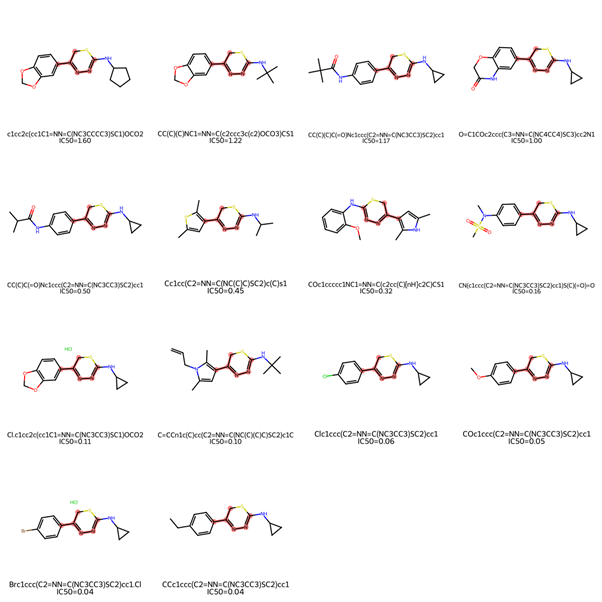
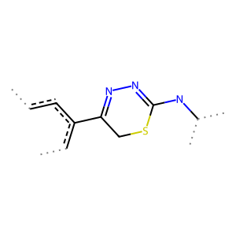

# Activity_Prediction_Machine_Learning – Iteration 2

Machine learning-guided SAR investigation of EU-OPENSCREEN data to identify chemically meaningful structural features associated with compound activity.

See iteration 1 for additional background on dataset preparation, descriptor generation, and initial model development.

---

## Overview

This iteration focused on reducing descriptor dimensionality and investigating whether important fingerprint features corresponded to meaningful SAR trends rather than dataset artefacts.

The goal was to move beyond generic descriptor-driven modelling and use model outputs to guide chemically interpretable feature engineering.

---

## Objectives

- Reduce descriptor dimensionality and improve model robustness  
- Introduce cross-validation for more reliable model evaluation  
- Investigate whether important model features reflect meaningful chemistry  
- Identify compound subsets suitable for SAR analysis  
- Generate hypotheses for future engineered features and docking studies  

---

## Key Finding

### Feature ECFP4_1462 identifies a chemically coherent compound series

- Feature ECFP4_1462 was identified as an important feature in the trained model  
- Unlike the outlier-driven feature identified in iteration 1, compounds containing this feature showed *clear structural similarity with controlled substituent variation suitable for SAR analysis*.  

---

## Interpretation

The feature appears to identify a chemically meaningful compound series.

These compounds share a common scaffold with systematic substituent variation, allowing activity differences to be interpreted in an SAR context.

Although this subset does not contain the most potent compounds in the dataset overall (29 compounds showed lower IC50 values), the structural coherence of the series makes it well suited for interpretable SAR investigation and hypothesis generation.

---

## Preliminary SAR Observations

Inspection of the identified scaffold series suggests several possible SAR trends.

### 4-Position substituent effects

Many compounds differ only at the 4-position of the phenyl ring, including the four most potent compounds within the series. This type of controlled structural variation is particularly useful for SAR analysis.

### Halogen substitution

- the bromide-substituted analogue was more potent than the corresponding chloro analogue  
- before overinterpreting this trend, the underlying experimental variability should be examined to determine whether the potency difference is meaningful  
- additional metrics (for example activity at fixed concentration) may help better differentiate activity for high potency compounds  

If the trend is genuine, both steric and electronic effects may contribute:
- Br and Cl differ in both atomic radius and electronic properties  
- both factors are known to influence molecular recognition and binding interactions  

Potential follow-up investigations:
- electrostatic modelling  
- molecular docking  
- comparison of halogen interaction geometries within the binding site  

Possible analogue extensions:
- fluoro and iodo analogues  
- nitrile substitution as a potential halogen bioisostere  

### Electronic effects may not fully explain activity

Ethyl substitution produced activity comparable to bromide despite very different expected electronic effects.

This suggests that electrostatics alone may not explain the observed SAR trends.

### Possible steric and hydrophobic contributions

Several observations suggest that steric effects and hydrophobic interactions may contribute significantly to activity:

- methylenedioxy substitution reduced activity relative to methoxy, ethyl, and halogen analogues  
- the presence of two oxygen atoms may alter hydrophobic interactions or introduce steric constraints within the binding pocket  
- the isobutyramide analogue showed lower activity  
- the tert-butyl analogue was weaker again despite broadly similar electronic characteristics  

Together, these trends suggest that steric effects may strongly influence binding.

### Other substituent effects:
- Another interesting trend comes from the methylenedioxy subset:
- cyclopropyl analogues outperformed related cyclopentyl and t-butyl analogues despite otherwise similar structures  

### Recommended follow-up

To better understand the observed SAR trends, useful next steps would include:
- molecular docking of representative analogues to identify potential interactions with the binding site
---

## Implications for Feature Engineering

These observations suggest that future engineered features may benefit from incorporating:

- docking-derived interaction features  
- steric descriptors  
- electrostatic surface properties  

rather than relying solely on generic fingerprint descriptors.

This project reflects a workflow where machine learning and medicinal chemistry are used together: models identify potential patterns, while chemical reasoning and SAR analysis are used to determine whether those patterns represent meaningful chemistry or dataset artefacts.

---

## Maximal Common Substructure

ECFP4 Fingerprints do not directly correspond to a single chemical fragment (the chemical substructure represented by an ECFP4 fingerprint can vary). A direct determination of the maximum common substructure of compunds containing this fingerprint is a useful alternative.

the maximal shared substructure among compounds containing ECFP4_1462:

---

## Recommended Next Steps

- examine the raw data to determine whether the potency difference between bromo and chloro analogues is meaningful relative to experimental variability  

- perform molecular docking studies on representative analogues to investigate:
  - binding interactions of the most potent cyclopropyl compounds  
  - potential steric disruptions introduced by cyclopentyl substitution  
  - effects of replacing the bromo substituent with methylenedioxy, isobutyramide, and related groups  

- if docking supports the proposed SAR trends, investigate additional analogue hypotheses including:
  - 4-iodo substitution  
  - smaller alkyl replacements for cyclopropyl (e.g. methyl)  

- incorporate docking-derived interaction information into feature engineering  
- derive engineered descriptors from docking and interaction analysis  
- retrain models using chemically interpretable feature sets  
- combine model-driven feature analysis with manual SAR inspection to identify more meaningful structural trends

